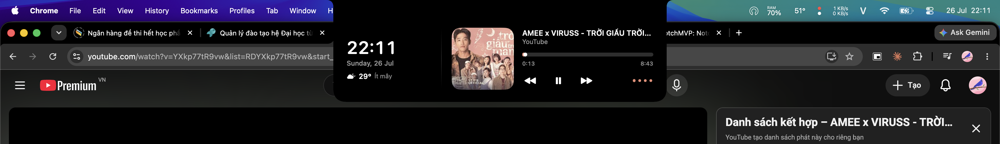

# NotchMVP

Một tiện ích nhỏ cho macOS, biến notch (tai thỏ) trên MacBook thành nơi hiển thị nhạc đang phát, đồng hồ/thời tiết và một "kệ" để tạm file — lấy cảm hứng từ [NotchNook](https://github.com/aleksey-nekrasov/NotchNook).

Ứng dụng chạy nền, không hiện icon trên Dock, chỉ có một biểu tượng `◗` nhỏ trên thanh menu bar.



Khi có nhạc mới phát hoặc đổi bài, một dải nhỏ hiện ra hai bên notch trong vài giây:


## Tính năng

- **Điều khiển nhạc** — nhận diện và điều khiển phát/dừng/chuyển bài từ Apple Music, Spotify, VLC, QuickTime và các trang nghe nhạc/video phổ biến đang mở trong trình duyệt (YouTube, SoundCloud, v.v.)
- **Dải mini** — khi nhạc bắt đầu phát hoặc đổi bài, ảnh bìa và waveform hiện ra ngay hai bên notch, tự ẩn sau vài giây
- **Bảng mở rộng** — di chuột vào notch để xem đồng hồ, thời tiết hiện tại, ảnh bìa lớn, tên bài hát, thanh tua và nút điều khiển; click vào ảnh bìa để mở tab/app đang phát
- **Waveform phản hồi âm thanh thực** — không phải hiệu ứng giả, lấy trực tiếp từ tín hiệu đang phát
- **Kệ file (Shelf)** — kéo file, ảnh hoặc đoạn văn bản thả vào notch để tạm giữ; kéo ra để dùng lại, click để xem trước (Quick Look), chuột phải để có thêm tùy chọn
- **Phím tắt toàn cục** — `⌥ Option + Space` để bật/tắt bảng mở rộng bất cứ đâu
- **Khởi động cùng macOS** — bật/tắt ngay trong menu `◗`
- **Cấu hình qua file JSON** — mọi con số (thời gian chờ, kích thước, phím tắt...) đều chỉnh được mà không cần build lại

## Cài đặt

### Cách 1 — Tải bản build sẵn (khuyên dùng)

1. Vào mục [Releases](../../releases) của repo này, tải file `NotchMVP.zip` mới nhất
2. Giải nén, kéo `NotchMVP.app` vào thư mục **Applications**
3. Vì app chỉ được ký ad-hoc (không phải tài khoản Apple Developer trả phí), lần đầu mở macOS sẽ chặn. Cách mở:
   - Chuột phải vào `NotchMVP.app` → **Open** → xác nhận **Open** lần nữa, **hoặc**
   - Vào **System Settings → Privacy & Security**, cuộn xuống thấy dòng cảnh báo về NotchMVP, bấm **Open Anyway**
4. Lần đầu chạy, macOS sẽ hỏi quyền:
   - **Automation** (điều khiển Music/Spotify/trình duyệt) — bắt buộc để điều khiển nhạc
   - **Location** (vị trí) — chỉ để hiển thị thời tiết, có thể từ chối nếu không cần
   - Nếu muốn điều khiển nhạc từ Chrome/tab trình duyệt: mở Chrome → **View → Developer → Allow JavaScript from Apple Events**

### Cách 2 — Build từ source

Yêu cầu: macOS 14+, Xcode hoặc Command Line Tools đã cài.

```bash
git clone https://github.com/willhope3101/NotchMVP.git
cd NotchMVP
./install.sh
```

`install.sh` sẽ build bản release, đóng gói thành `.app`, dừng mọi bản đang chạy, cài vào `/Applications`, trỏ lại mục khởi động cùng macOS, và mở app.

## Cấu hình

Từ menu `◗` trên menu bar → **Mở file cài đặt** để sửa `~/Library/Application Support/NotchMVP/settings.json`, sau đó chọn **Tải lại cài đặt** để áp dụng ngay mà không cần khởi động lại app.

## Gỡ cài đặt

1. Menu `◗` → **Thoát**
2. Xóa `/Applications/NotchMVP.app`
3. Xóa thư mục cấu hình: `~/Library/Application Support/NotchMVP`
4. Nếu đã bật khởi động cùng macOS: xóa file LaunchAgent tương ứng trong `~/Library/LaunchAgents`
