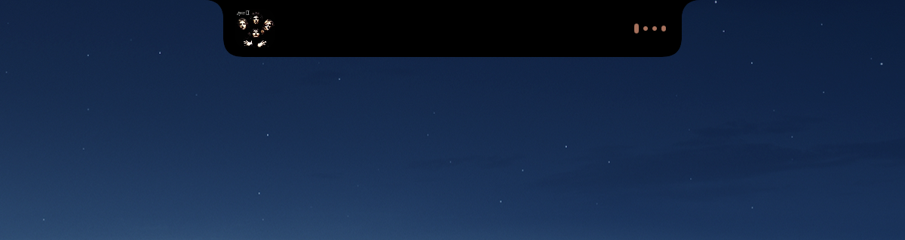

# NotchMVP

A small macOS utility that turns your MacBook's notch into a home for now-playing media, a clock/weather widget, and a temporary shelf for files — inspired by [NotchNook](https://github.com/aleksey-nekrasov/NotchNook).

The app runs in the background with no Dock icon, just a small `◗` icon in the menu bar.


When new music starts or the track changes, a small pill appears on either side of the notch for a few seconds:



## Features

- **Media controls** — detects and controls play/pause/skip from Apple Music, Spotify, VLC, QuickTime, and popular music/video sites open in your browser (YouTube, SoundCloud, etc.)
- **Mini pill** — cover art and a waveform appear right beside the notch when playback starts or the track changes, then fade away on their own
- **Expanded panel** — hover the notch to see the clock, current weather, full-size artwork, track title, scrub bar, and transport controls; click the artwork to jump to the tab/app that's playing
- **Real audio-reactive waveform** — not a canned animation, it's driven by the actual playing audio
- **File shelf** — drag files, images, or text snippets onto the notch to hold onto them; drag them back out to use, click for a Quick Look preview, right-click for more options
- **Global hotkey** — `⌥ Option + Space` toggles the expanded panel from anywhere
- **Launch at login** — toggle right from the `◗` menu
- **JSON-based configuration** — every tunable (timeouts, sizes, hotkey) is editable without rebuilding

## Installation

### Option 1 — Download a prebuilt release (recommended)

1. Go to this repo's [Releases](../../releases) page and download the latest `NotchMVP.zip`
2. Unzip it and drag `NotchMVP.app` into your **Applications** folder
3. Since the app is only ad-hoc signed (no paid Apple Developer account), macOS will block it the first time. To open it:
   - Right-click `NotchMVP.app` → **Open** → confirm **Open** again, **or**
   - Go to **System Settings → Privacy & Security**, scroll down to the warning about NotchMVP, and click **Open Anyway**
4. On first launch, macOS will ask for a couple of permissions:
   - **Automation** (to control Music/Spotify/your browser) — required for media control
   - **Location** — only used to show the current weather; you can deny it if you don't want that
   - To control playback from a Chrome tab: open Chrome → **View → Developer → Allow JavaScript from Apple Events**

### Option 2 — Build from source

Requires macOS 14+ and Xcode or the Command Line Tools.

```bash
git clone https://github.com/willhope3101/NotchMVP.git
cd NotchMVP
./install.sh
```

`install.sh` builds a release binary, wraps it into a `.app`, stops any running copy, installs it to `/Applications`, repoints the login item, and launches it.

## Configuration

From the `◗` menu bar item → **Open Settings File** to edit `~/Library/Application Support/NotchMVP/settings.json`, then choose **Reload Settings** to apply changes immediately without restarting the app.

## Uninstalling

1. `◗` menu → **Quit**
2. Delete `/Applications/NotchMVP.app`
3. Delete the config folder: `~/Library/Application Support/NotchMVP`
4. If you enabled launch at login: remove the matching LaunchAgent file from `~/Library/LaunchAgents`
